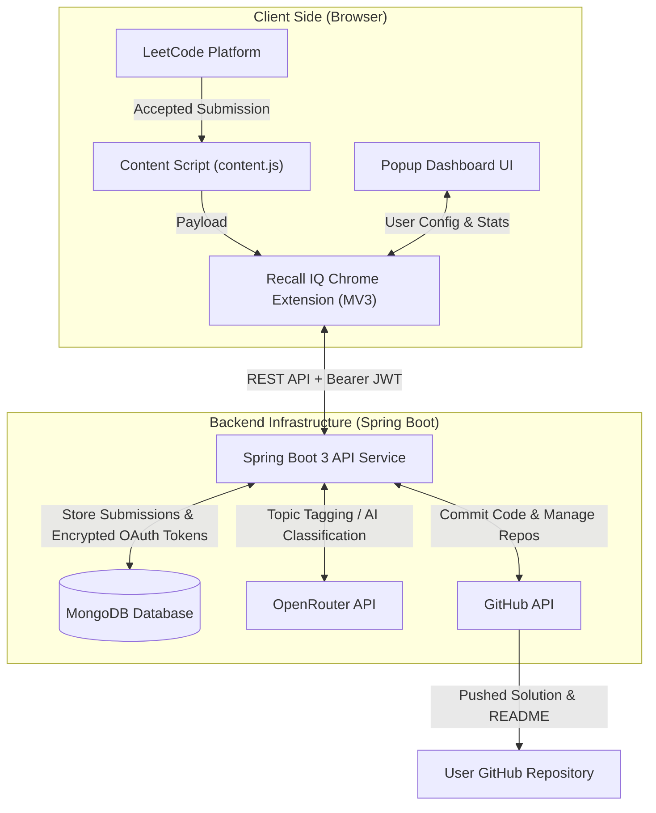

# Recall IQ 🚀


**Recall IQ** is an end-to-end automated solution tracking and analytics platform for developers practicing Data Structures and Algorithms on **LeetCode**. 

It automatically intercepts accepted coding submissions, categorizes problem topics, generates formatted solution documentation, syncs code directly to a designated **GitHub repository**, and visualizes problem-solving analytics through an interactive Chrome Extension dashboard.

---

## 🌟 System Architecture Overview



---

## ✨ Key Features

- ⚡ **Zero-Click Solution Sync**: Automatically detects "Accepted" LeetCode submissions and commits source code, memory usage, runtime metrics, and problem README to GitHub.
- 🔐 **Secure OAuth 2.0 & Token Storage**: Authenticates using GitHub OAuth 2.0; tokens are stored at rest using **AES-256 encryption** in MongoDB.
- 📊 **Interactive Analytics Dashboard**: Live breakdown of solved problems by difficulty (Easy, Medium, Hard), topic distribution, recent activity timeline, and active repository connection.
- 📁 **Repository Creator & Switcher**: Select an existing GitHub repo or create a brand new target repository directly from the extension popup.
- 🧠 **AI-Powered Topic Tagging**: Automatically categorizes problem topics via OpenRouter API integration.
- 🛡️ **Duplicate Prevention & Revision History**: Ensures submissions are deduplicated while updating your progress seamlessly.

---

## 📂 Repository Components

This monorepo contains two primary components:

| Component | Path | Description |
| :--- | :--- | :--- |
| **Backend Service** | [`/backend`](file:///d:/RESUME-Projects/Recall_IQ/backend/README.md) | Spring Boot 3 Java backend providing OAuth, JWT auth, MongoDB storage, and GitHub integration. |
| **Chrome Extension** | [`/extension`](file:///d:/RESUME-Projects/Recall_IQ/extension/README.md) | Chrome Manifest V3 extension capturing LeetCode submissions and rendering the dashboard UI. |

---

## 🛠️ Tech Stack

### Frontend / Extension
- **Manifest Version**: Chrome Extension Manifest V3
- **Languages**: JavaScript (ES6+), HTML5, Vanilla CSS3 (Glassmorphism design)
- **APIs**: Chrome Storage API, Chrome Identity API (`launchWebAuthFlow`)

### Backend / Server
- **Language**: Java 21
- **Framework**: Spring Boot 3.5.x, Spring Security
- **Database**: MongoDB (Spring Data MongoDB)
- **Security**: JJWT (Java JWT), AES-256 Token Encryption
- **Integrations**: GitHub REST API (`RestClient`), OpenRouter API

---

## 🚀 Quick Start Guide

### Prerequisites
- **Google Chrome** browser
- **Java 21 JDK** & **Maven** (for running backend locally)
- **MongoDB** database URI
- **GitHub OAuth App** (Client ID & Client Secret)

---

### Step 1: Set Up & Run the Backend Service

1. Navigate to the backend directory:
   ```bash
   cd backend
   ```

2. Configure environment variables in `src/main/resources/application-local.properties`:
   ```properties
   SPRING_DATA_MONGODB_URI=mongodb+srv://<user>:<password>@cluster.mongodb.net/recalliq
   GITHUB_CLIENT_ID=your_github_client_id
   GITHUB_CLIENT_SECRET=your_github_client_secret
   GITHUB_REDIRECT_URI=http://localhost:8080/api/auth/callback
   JWT_SECRET=your_super_secret_jwt_key_at_least_256_bits
   ENCRYPTION_SECRET_KEY=16ByteSecretKey!
   OPENROUTER_API_KEY=your_openrouter_api_key
   ```

3. Build and run the server:
   ```bash
   ./mvnw clean package -DskipTests
   ./mvnw spring-boot:run
   ```
   *The API server will run at `http://localhost:8080`.*

> For full backend API details, visit [`backend/README.md`](file:///d:/RESUME-Projects/Recall_IQ/backend/README.md).

---

### Step 2: Install & Activate Chrome Extension

1. Open **Google Chrome** and go to `chrome://extensions/`.
2. Enable **Developer mode** (toggle in the top-right corner).
3. Click **Load unpacked** (top-left button).
4. Select the [`/extension`](file:///d:/RESUME-Projects/Recall_IQ/extension) directory from this repository.
5. Pin **Recall IQ** 📌 to your Chrome toolbar.
6. Click the extension icon and select **Sign in with GitHub**.

> For full Chrome Extension setup and troubleshooting, visit [`extension/README.md`](file:///d:/RESUME-Projects/Recall_IQ/extension/README.md).

---

## 🛠️ Troubleshooting & FAQ

<details>
<summary><b>1. "Manifest file is missing" when loading extension in Chrome?</b></summary>
Make sure you select the <code>extension</code> subfolder (which contains <code>manifest.json</code>), not the root folder of the repository.
</details>

<details>
<summary><b>2. Solutions are not syncing to GitHub?</b></summary>
Ensure that:
1. You are logged into the extension via GitHub OAuth.
2. An active repository is selected or created under the extension's <b>Repository</b> tab.
3. The Spring Boot backend service is running and accessible.
</details>

<details>
<summary><b>3. How are OAuth tokens secured?</b></summary>
GitHub OAuth access tokens are encrypted using AES-256 before being written to the MongoDB database. Access tokens are decrypted in memory only when committing solutions on behalf of the authenticated user.
</details>

---

## 🤝 Contributing

Contributions are welcome! Please follow these steps:
1. Fork the project repository.
2. Create a feature branch (`git checkout -b feature/AmazingFeature`).
3. Commit your changes (`git commit -m 'Add some AmazingFeature'`).
4. Push to the branch (`git push origin feature/AmazingFeature`).
5. Open a Pull Request.

---

## 📜 License

Developed with Integrity and Innovation by **Sriii Technologies**.
Distributed under the [MIT License](LICENSE).
