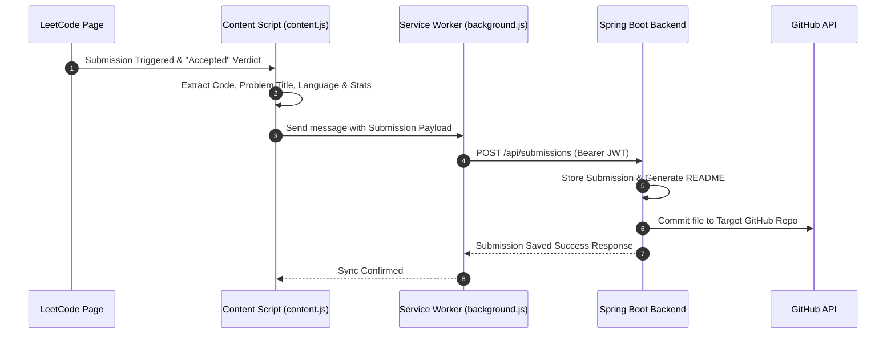

# Recall IQ - Chrome Extension 🧩


**Recall IQ Extension** is a Manifest V3 Chrome Extension designed to seamlessly capture, structure, and sync your accepted LeetCode solutions directly to your configured GitHub repository while recording statistics into your personal Recall IQ dashboard.

---

## ✨ Features

- ⚡ **Automated Solution Capture**: Detects when you submit a solution on LeetCode and intercepts the "Accepted" verdict with problem details, difficulty, runtime/memory stats, and source code.
- 🔐 **Secure GitHub OAuth Integration**: Authenticates via `chrome.identity.launchWebAuthFlow` using JWT authorization tokens issued by the backend service.
- 📁 **Repository Management**: Select an existing GitHub repository or create a new dedicated solution repo directly from the popup UI.
- 📊 **Interactive Popup Dashboard**: View real-time solve counts broken down by difficulty (Easy, Medium, Hard), topic distribution, recent submissions, and sync status.
- 🎨 **Modern Sleek Interface**: Dark-themed UI with glassmorphism design, smooth micro-animations, and instant responsiveness.

---

## 📂 Extension Directory Architecture

```text
extension/
├── assets/                  # App icons and brand assets
│   └── logo.jpg
├── components/              # Modular UI component scripts
│   ├── auth-view.js
│   ├── dashboard-view.js
│   ├── history-view.js
│   └── repo-view.js
├── pages/                   # Additional views
│   └── history.html
├── services/                # API and communication logic
│   └── api.js
├── utilities/               # Helper methods and utilities
├── background.js           # Service Worker (Background script)
├── content.js               # Page-injected content script (LeetCode DOM & event listener)
├── content-bridge.js        # Main-world script bridge
├── manifest.json            # Manifest V3 extension configuration
├── oauth.html               # OAuth redirection receiver page
├── oauth.js                 # OAuth token extractor
├── popup.html               # Extension Popup DOM layout
├── popup.js                 # Popup controller & UI manager
├── styles.css               # Main extension styling (CSS variables, layout & themes)
└── README.md
```

---

## ⚙️ Installation Guide

Follow these steps to load the unpacked extension in Google Chrome:

1. **Download / Clone the Repository**:
   Ensure you have downloaded or cloned the project files onto your computer.

2. **Open Extensions Page in Chrome**:
   - Launch **Google Chrome**.
   - Navigate to `chrome://extensions/` in the address bar.

3. **Enable Developer Mode**:
   - Toggle the **Developer mode** switch located in the top-right corner to **On**.

4. **Load Unpacked Extension**:
   - Click the **Load unpacked** button in the top-left corner.
   - Browse to the project folder and select the `extension` folder (the directory containing `manifest.json`).
   - Click **Select Folder**.

5. **Pin the Extension**:
   - Click the **Extensions puzzle icon** 🧩 next to Chrome's address bar.
   - Locate **Recall IQ** and click the **Pin** 📌 icon for quick access.

---

## 🚀 How to Use

1. **Sign In**:
   - Click the Recall IQ extension icon in your toolbar.
   - Click **Sign in with GitHub**. An OAuth window will open allowing you to authorize the app.

2. **Select or Create a Repository**:
   - After signing in, choose an existing GitHub repository from the dropdown or click **Create New Repository** to create a target repo (e.g. `LeetCode-Solutions`).

3. **Solve DSA Problems**:
   - Go to [LeetCode](https://leetcode.com/problems/).
   - Write and submit your code.
   - Upon receiving an **"Accepted"** verdict, Recall IQ will automatically capture your code, generate problem documentation, commit it to GitHub, and update your statistics!

---

## 🔍 How Solution Interception Works



---

## 🛠️ Troubleshooting

| Issue | Cause & Solution |
| :--- | :--- |
| **"Manifest file is missing"** | Ensure you selected the `extension` subdirectory when clicking **Load unpacked**, not the root folder. |
| **"Authentication Failed"** | Verify that the Spring Boot backend server is running and accessible (default `http://localhost:8080` or `https://recall-iq.onrender.com`). |
| **"Submissions not syncing"** | Check if you have configured an active target repository in the extension popup interface under the **Repository** tab. |
| **"Extension card error after changes"** | Open `chrome://extensions/` and click the **Reload** 🔄 button on the Recall IQ extension card. |
| **"Identity API error"** | Make sure Chrome is signed in or `https://*.chromiumapp.org/*` host permissions are allowed. |

---

## 📄 Manifest Permissions

- `storage`: For persisting local settings, active user token, and repo selection.
- `identity`: For performing Chrome Web Auth Flow with GitHub OAuth.
- `host_permissions`: Access required for `https://leetcode.com/*`, `https://github.com/*`, `https://api.github.com/*`, and backend domain.
